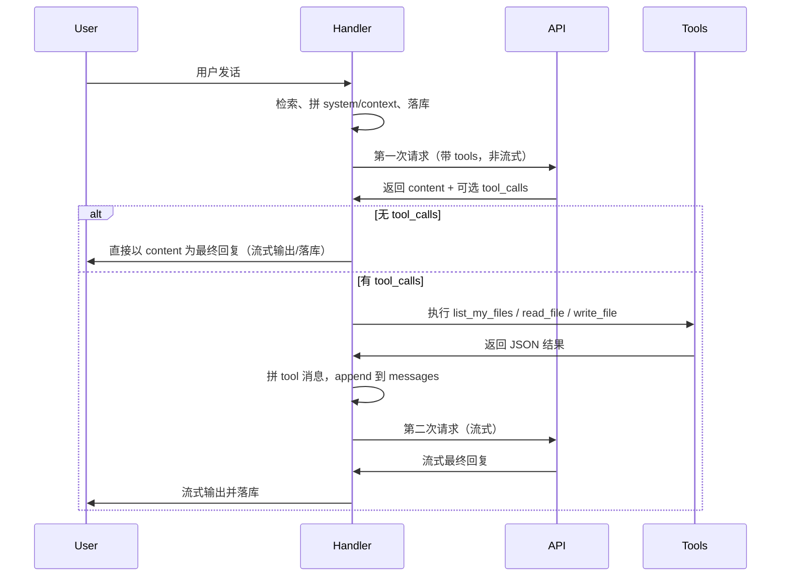

# Aris「自己文件夹」工具与流程设计

本文档描述如何让应用内与用户对话的 Aris（LLM）具备**查看与修改自己专属目录**的能力：列出文件、读文件、写文件，且仅限该目录，不越权。

---

## 1. 目标

- **查看**：Aris 能列出自己文件夹下的文件与子目录，并能读取指定文件的文本内容。
- **修改**：Aris 能在该目录下新建或覆盖/追加文本文件（例如用户说「把这句话记下来」「存到 xxx」）。
- **范围**：所有操作仅限「Aris 自己的文件夹」，不触及用户其它目录或应用内部库/配置。

---

## 2. 「自己的文件夹」约定

| 项目 | 约定 |
|------|------|
| 根路径 | 与现有 userData 一致：`app.getPath('userData')/aris`，再下建子目录 **`agent`**，即 `userData/aris/agent` |
| 用途 | 仅用于 Aris 通过工具读写的内容（用户说「把这句话记下来」「看看我上次让你存的」等） |
| 与现有目录关系 | 与 `aris.db`、`lancedb` 同级；项目内用户身份在 `memory/user_identity.json`；首次使用前若不存在则创建 `agent` |

路径解析建议复用或对齐现有 `getUserDataPath()`（如 `src/store/db.js`、`src/memory/lancedb.js`），在实现里用：

- `agentBasePath = path.join(getUserDataPath(), 'agent')`
- 所有工具只接受**相对路径**，在实现中 `path.resolve(agentBasePath, userPath)` 后做**路径校验**（见第 5 节）。

---

## 3. 工具定义（DeepSeek/OpenAI 兼容）

以下三个 function 供 LLM 在对话中调用，名称与参数保持与设计一致即可。

### 3.1 `list_my_files`

- **描述（给模型）**：列出 Aris 自己文件夹中的文件和子目录。可指定相对子路径（如 `notes` 或空字符串表示根目录）。
- **参数**：
  - `subpath`（string，可选，默认 `""`）：相对路径，不能含 `..`。
- **返回**（实现后拼成 tool result 给模型）：
  - 成功：`{ "ok": true, "entries": [ { "name": "xxx", "type": "file"|"dir" } ] }`
  - 失败：`{ "ok": false, "error": "原因" }`

### 3.2 `read_file`

- **描述**：读取 Aris 自己文件夹中某个文件的文本内容（UTF-8）。用于用户说「看看你记的」「打开某文件」等。
- **参数**：
  - `relative_path`（string，必填）：相对路径，不能含 `..`。
- **返回**：
  - 成功：`{ "ok": true, "content": "文件内容" }`（若文件很大可截断并注明，见 5.2）
  - 失败：`{ "ok": false, "error": "原因" }`

### 3.3 `write_file`

- **描述**：在 Aris 自己文件夹中写入或覆盖一个文件。用于用户说「把这句话记下来」「存到 xxx」等。
- **参数**：
  - `relative_path`（string，必填）：相对路径，不能含 `..`。
  - `content`（string，必填）：要写入的文本。
  - `append`（boolean，可选，默认 false）：true 表示追加，false 表示覆盖。
- **返回**：
  - 成功：`{ "ok": true, "path": "相对路径" }`
  - 失败：`{ "ok": false, "error": "原因" }`

### 3.4 API 请求中的 tools 格式示例

请求 DeepSeek 时，将上述三个 function 按 OpenAI 的 `tools` 格式给出，例如：

```json
[
  {
    "type": "function",
    "function": {
      "name": "list_my_files",
      "description": "列出你自己文件夹中的文件和子目录。可传 subpath 表示子目录（如 notes），不传则列根目录。",
      "parameters": {
        "type": "object",
        "properties": {
          "subpath": { "type": "string", "description": "相对子路径，如 notes 或空", "default": "" }
        }
      }
    }
  },
  {
    "type": "function",
    "function": {
      "name": "read_file",
      "description": "读取你自己文件夹中某个文件的文本内容（UTF-8）。",
      "parameters": {
        "type": "object",
        "properties": {
          "relative_path": { "type": "string", "description": "相对路径" }
        },
        "required": ["relative_path"]
      }
    }
  },
  {
    "type": "function",
    "function": {
      "name": "write_file",
      "description": "在你自己的文件夹中写入或覆盖一个文件。",
      "parameters": {
        "type": "object",
        "properties": {
          "relative_path": { "type": "string", "description": "相对路径" },
          "content": { "type": "string", "description": "要写入的文本" },
          "append": { "type": "boolean", "description": "是否追加", "default": false }
        },
        "required": ["relative_path", "content"]
      }
    }
  }
]
```

---

## 4. 流程（对话 + 工具的一轮）

整体思路：**先带 tools 请求一次；若有 tool_calls 则执行并再请求一次（可流式）得到最终回复**。



步骤简述：

1. **用户发话**：与现在一样，`handler.handleUserMessage(userContent, sendChunk)`，先做检索、拼 system/context、写 DB 等。
2. **第一次 LLM 请求（带 tools，非流式）**：请求体为当前 `messages` + `tools`（上述三个 function）。使用 **非流式** `chat/completions`（`stream: false`），便于直接拿到完整 `message` 和可能的 `tool_calls`。
3. **若响应中无 tool_calls**：把该 `message.content` 当作最终回复：落库、发 chunk 给前端、做记忆/身份/纠错等后处理，结束。
4. **若有 tool_calls**：在主进程内按 `name` 调用对应实现（见第 5 节）；每个 tool 返回一个字符串（如 `JSON.stringify({ ok, ... })`），按 DeepSeek/OpenAI 约定拼成 **tool 消息**（`role: "assistant"` 带 `tool_calls` + `role: "tool"` 带 `tool_call_id` 与 `content`），append 到 `messages`，再发**第二次请求**（流式），把最终回复通过现有 `sendChunk` 流式输出，然后落库与记忆/身份/纠错。
5. **落库与记忆**：只把**最终对用户可见的那条回复**写入对话历史与记忆；中间「助手调用了工具」的那条可选择性不落库或落库为系统侧记录。

多轮工具调用（同一用户消息内可多次「请求 → 执行工具 → 再请求」）详见 [TASK_FLOW_AND_MULTIROUND_TOOLS.md](TASK_FLOW_AND_MULTIROUND_TOOLS.md)。

---

## 5. 实现要点（主进程）

### 5.1 新模块 `src/agentFiles.js`

- **职责**：
  - 提供 `getAgentBasePath()`：`path.join(getUserDataPath(), 'agent')`，必要时创建目录。
  - 实现 `listMyFiles(subpath)`、`readFile(relativePath)`、`writeFile(relativePath, content, append)`，内部统一做路径校验。

- **路径校验**（防止越权）：
  - 只接受相对路径，禁止 `..` 和绝对路径。
  - 使用 `path.resolve(agentBasePath, relativePath)` 得到绝对路径，再判断 `resolved.startsWith(agentBasePath)`（注意跨平台用 `path.normalize` 或比较规范化后的路径）。
  - 不通过则返回 `{ ok: false, error: "路径不允许" }`。

### 5.2 安全与边界

- **禁止**：`..`、绝对路径、链接逃逸（可用 `fs.realpathSync` 再次校验在 base 下）。
- **大文件**：`read_file` 可限制大小（如 512KB），超出返回截断 + 说明，避免 token 爆掉。
- **二进制**：仅支持 UTF-8 文本；若检测到非文本可返回错误或跳过，不把二进制内容塞给模型。
- **文件名**：可限制字符集（例如仅允许安全文件名），避免创建系统敏感名称。

### 5.3 与 electron.main 的配合

- 工具执行都在 **主进程** 完成（在 `handler.js` 或由 main 调用的逻辑里 require `agentFiles.js` 并执行三个函数）。
- 不需要在 preload 里为「工具」单独暴露 IPC；对话与工具调用仍在 `dialogue:send` 的调用链内完成。

---

## 6. 与现有组件的衔接

| 组件 | 改动要点 |
|------|----------|
| **api.js** | 增加「带 tools 的非流式请求」函数（如 `chatWithTools(messages, tools)`），返回 `{ content, tool_calls }`；流式接口保留用于第二次请求。 |
| **handler.js** | 在拼好 `messages` 后先调带 tools 的请求；若有 `tool_calls`，执行工具、拼 tool 消息、再调一次（流式）得到最终回复；最后统一做 append 落库、记忆/身份/纠错。 |
| **prompt.js / persona** | 在 system 或 persona 中增加简短说明：Aris 拥有一个「自己的文件夹」，可通过 `list_my_files`、`read_file`、`write_file` 查看与修改；仅在用户明确要求存/读/列文件时使用，使用后用自然语言回复结果。 |

---

## 7. Prompt 补充示例

在 system 或 context 中增加一段，例如：

```text
你有一个仅自己可用的文件夹（位于应用数据目录下）。你可以通过以下能力与它交互：
- list_my_files：列出该文件夹中的文件和子目录（可指定子路径）。
- read_file：读取其中某个文件的文本内容。
- write_file：在其中创建或覆盖/追加一个文本文件。

仅当用户明确要求你「记下来、存起来、写进文件、看看你记的、列出你的文件」等时，才调用这些工具；完成后用简短自然语言告诉用户结果，不要堆砌 JSON。
```

---

## 8. 小结

- **工具**：`list_my_files`、`read_file`、`write_file`，参数与返回如上，全部限定在 `userData/aris/agent`。
- **流程**：先非流式带 tools 请求 → 若有 tool_calls 则在主进程执行并拼 tool 消息 → 再流式请求一次得到最终回复 → 再落库与记忆。
- **实现**：新模块 `src/agentFiles.js` 做路径解析与校验 + 三个实现函数；api 增加带 tools 的非流式；handler 里串起「请求 → 执行工具 → 再请求」；prompt 里说明 Aris 何时、如何用这些工具。
- **安全**：路径限定在 agent 根下、禁止 `..`、大文件截断、仅 UTF-8 文本、文件名/字符集限制。

按上述设计实现后，Aris 就可以在对话中「查看并修改自己文件夹」的内容，且不越权、不破坏现有存储与对话逻辑。
