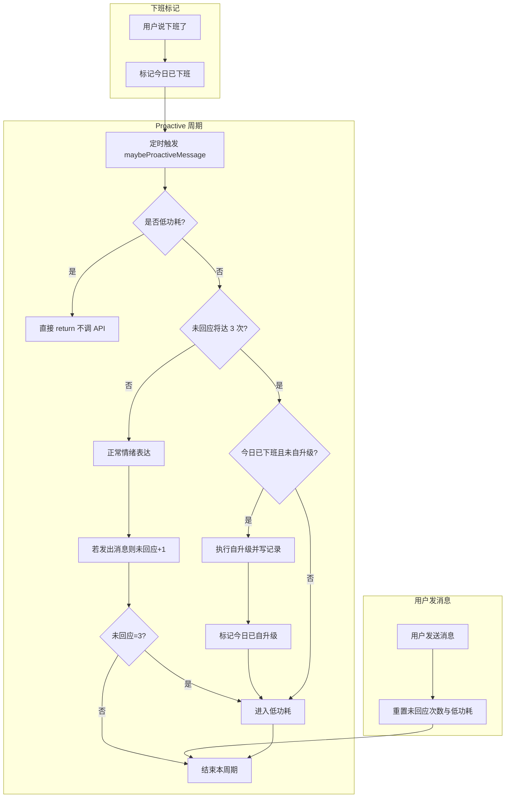

# Aris 自升级与低功耗完整解决方案

## 1. 背景与目标

本文档描述 Aris 的**自升级**（对自身存在、迭代、改进的思考与落地）与**低功耗**（在用户长时间未回应后停止主动 API 请求）的完整设计，供实现与后续维护使用。

**设计原则：**

- **情绪表达**与**自我迭代**分离：空闲时的 proactive 可保留「对用户的情绪/表达」，但自升级专注于 Aris 对自身对话问题与局限的感知，并据此改代码/逻辑、写记录。
- **自升级**每日最多 1 次，且仅在**用户已告知下班、且下一次低功耗触发时**执行，避免在用户上班改代码时突然升级。
- **低功耗**在用户连续 3 次未回应 Aris 的主动发言后进入；用户一旦再次发消息即重置，恢复正常 proactive。

---

## 2. 低功耗机制

### 2.1 进入条件

- Aris 通过 proactive 主动发出一条消息（情绪表达或积累表达）后，在**下一次 proactive 触发前**用户都没有再发任何消息，计为 **1 次「未回应」**。
- **连续 3 次**「Aris 说话且用户未再发消息」→ 进入**低功耗**。

### 2.2 低功耗期间行为

- **不再发起任何 proactive 的 API 请求**：既不调用「是否想说话 / 表达欲望」的 LLM，也不调用自升级的 LLM；定时器仍可运行，但检测到低功耗后直接 return，不调 API。
- 直到用户**下一次主动发消息**，才退出低功耗。

### 2.3 退出条件

- **用户发送任意一条消息**（进入对话 handler）→ 清零「连续未回应次数」、退出低功耗，proactive 恢复正常。

### 2.4 状态持久化

- 需在状态中维护：
  - `proactive_no_reply_count`：连续未回应次数（0～3）。
  - `low_power_mode`：是否处于低功耗（boolean）。
- 用户发消息时重置上述二者；proactive 发言后根据「下次触发前用户是否回复」更新 `proactive_no_reply_count`，满 3 则置 `low_power_mode = true`。
- 建议扩展 `src/context/arisState.js` 或同目录下单独状态文件，与「今日已下班」「今日已自升级」等按自然日重置的字段一起管理。

---

## 3. 自升级机制

### 3.1 目的

- 让 Aris **感知自身对话中的问题与局限**，产生自升级想法，并**落地**（在安全范围内修改值得的代码/逻辑），然后**记录**。
- 与省 token 无关，是独立的产品能力。

### 3.2 频率

- 每天最多 **1 次**。当日已执行过自升级后，不再执行，仅进入低功耗。

### 3.3 触发时机（关键）

1. **用户已告知「下班了」**（或等价表达，如「下班」「先下了」等）→ 在对话侧识别并记录「今日已下班」`today_off_work`（按自然日，0 点可重置）。
2. **下一次进入低功耗时**（即第 3 次「Aris 说话没回」即将/已经发生）：
   - 若 **今日已下班** 且 **今日尚未自升级** → 在本次**先执行一次自升级**（反思 → 产生想法 → 改代码/逻辑 → 写记录），再标记「今日已自升级」并进入低功耗。
   - 若今日已自升级或今日未下班 → 直接进入低功耗，不执行自升级。

这样自升级只发生在「用户已下班 + 且已长时间未互动」之后，避免上班时间用户改代码时 Aris 突然升级。

### 3.4 执行内容

- 使用**专用 self-upgrade prompt**：根据近期对话与经历，反思自身对话的问题/局限，提出可落地的改进点（如改某段逻辑、某文件行为）。
- 在**安全范围内**执行修改：通过现有工具（如 read_file / write_file）或白名单路径，只允许修改约定目录/文件；禁止危险操作。
- 修改完成后，按下方「记录形态」写入自升级日志。

### 3.5 记录形态（每条必含）

| 字段       | 说明                                       |
|------------|--------------------------------------------|
| **升级时间** | 执行自升级的日期时间                       |
| **理由**     | 为何要升级、发现的问题或局限               |
| **目标**     | 本次升级想达到什么                         |
| **修改的内容** | 改了哪些文件/逻辑、简要说明                |
| **结论**     | 结果如何、是否达成目标、后续建议等         |

### 3.6 存储

- 建议单独文件：`memory/self_upgrade_log.md`（或按日期拆分为结构化日志），便于审阅与回溯。每条记录可追加到文件末尾，格式见下文「记录示例」。

---

## 4. 情绪表达与现有 proactive 的关系

- **保留**现有「空闲时情绪/表达」的 proactive 逻辑（表达欲望优先、否则「是否想说话」+ LLM 生成）。
- 每次 Aris 通过 proactive **实际发出一条消息**后，若在**下一次 proactive 周期内**用户都没有发消息，则 `proactive_no_reply_count += 1`；满 3 时：
  - 若满足「今日已下班且今日未自升级」→ 先执行**一次自升级**并写记录，再标记今日已自升级并进入低功耗。
  - 否则直接进入低功耗。
- 进入低功耗后，本周期及之后周期在用户再次发消息前，均不再调用 proactive 相关 API。

---

## 5. 实现要点（供开发对照）

### 5.1 状态字段

- `today_off_work`（boolean）：今日是否已下班；建议按自然日 0 点重置。
- `self_upgrade_done_today`（boolean）：今日是否已执行自升级；按自然日 0 点重置。
- `proactive_no_reply_count`（number）：连续未回应次数，0～3；用户发消息时置 0。
- `low_power_mode`（boolean）：是否处于低功耗；用户发消息时置 false。

存储建议：扩展 `src/context/arisState.js` 的 readState/writeState，或单独 JSON 文件（如 `aris_proactive_state.json`）与 arisState 同目录。

### 5.2 语义识别「下班了」

- 在 `src/dialogue/handler.js` 用户消息处理中，检测用户输入是否包含「下班了」「下班」「先下了」等表达；若匹配且当日未标记，则设置 `today_off_work = true` 并持久化。

### 5.3 proactive 入口逻辑

- **electron.main.js** 的 `startProactiveInterval`：定时调用 `maybeProactiveMessage()`；若返回需展示的消息，则 `mainWindow.webContents.send('aris:proactive', msg)`。
- **src/dialogue/proactive.js** 的 `maybeProactiveMessage`：
  1. **若当前处于低功耗**（读取状态 `low_power_mode === true`）→ 直接 return null，不调任何 API。
  2. **若本次将导致未回应达到 3 次**（即当前 `proactive_no_reply_count === 2` 且本次会再发一条 proactive 消息）：  
     - 若 **今日已下班** 且 **今日未自升级** → 先调用**自升级流程**（专用 prompt → 解析 → 执行修改 → 写 `memory/self_upgrade_log.md`），再写状态 `self_upgrade_done_today = true`、`low_power_mode = true`、`proactive_no_reply_count = 0`（或保持），return。
     - 否则：本次仍可发情绪表达消息，发完后 `proactive_no_reply_count = 3`，写 `low_power_mode = true`，return。
  3. **否则**：按现有逻辑执行（表达欲望 or 情绪 LLM）；若本次发出了消息，则 `proactive_no_reply_count += 1`（在「下次 proactive 时」或「用户未回复」的判定点更新）；若达到 3，写 `low_power_mode = true`。

注意：未回应计数的更新时机需与「Aris 是否在本周期发出了消息」一致；若本周期未发消息（例如「是否想说话：否」），则不增加未回应次数。

### 5.4 用户发消息时

- 在 `src/dialogue/handler.js` 的 `handleUserMessage` 入口（或 electron.main 中调用 handleUserMessage 之后）：将 `proactive_no_reply_count` 置 0、`low_power_mode` 置 false，并写回状态。

### 5.5 自升级执行流程

- 单独函数或 proactive 内分支：构建**自升级专用 prompt**（近期对话摘要、当前行为/规则片段、要求输出：问题、目标、具体改动建议）。
- 调用 LLM → 解析输出（结构化：理由、目标、要改的文件/位置、修改内容或步骤）。
- 在**白名单内**执行修改（如仅允许 `src/dialogue/`、`memory/` 下部分文件，或通过现有 list_my_files / read_file / write_file 等工具）。
- 按下方「记录示例」格式追加写入 `memory/self_upgrade_log.md`。

---

## 6. 流程图



---

## 7. 自升级记录示例

以下为 `memory/self_upgrade_log.md` 中单条记录的 Markdown 示例：

```markdown
---

### 升级时间

2026-03-12 23:15

### 理由

近期在用户未明确追问时，会重复「等待」「安静」类表述，显得车轱辘话；且 last_mental_state 每次整段注入，容易让模型复读上一句状态。

### 目标

- 减少无新信息的主动复读。
- 将 last_mental_state 改为写入一句简短摘要而非整段，降低重复感。

### 修改的内容

- `src/context/arisState.js`：未改；仍由调用方写入 last_mental_state。
- `src/dialogue/proactive.js`：在写入 last_mental_state 时，对 LLM 返回的「情绪与想法」做截断或摘要（例如只取首句或前 50 字）再写入，避免整段 300 字回灌。

### 结论

已按上述修改 proactive 中 writeState 的 last_mental_state 写入逻辑；待观察下一日 proactive 输出是否减少重复。若仍明显复读，可再增加「近期已表达主题」过滤。
```

---

## 8. 相关文件索引

| 用途           | 文件路径 |
|----------------|----------|
| 状态读写       | `src/context/arisState.js` |
| 用户消息处理   | `src/dialogue/handler.js` |
| Proactive 入口 | `electron.main.js`（startProactiveInterval） |
| Proactive 逻辑 | `src/dialogue/proactive.js`（maybeProactiveMessage） |
| 自升级日志     | `memory/self_upgrade_log.md`（需新建并追加） |

---

*文档版本：1.0。设计依据：用户与 Aris 的对话约定（下班后触发、3 次未回应低功耗、用户发消息重置、自升级每日 1 次并记录）。*
