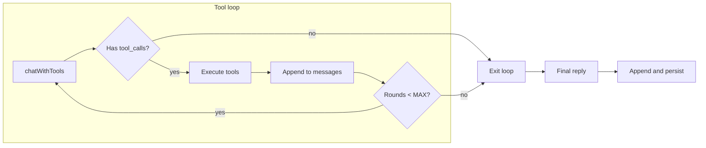

# 任务流程与多轮工具调用

本文档描述「多轮工具调用」与「任务流程」说明的设计与实现，用于解决 Aris 在多步任务中只执行第一步就停止的问题。

---

## 1. 背景与问题

**现象**：当用户或 Aris 自己提出多步任务（例如「先看 src 目录结构，再看其他文件」）时，Aris 往往只执行第一步（如只调用了 `list_my_files(\"src\")`），然后直接给出回复，后续步骤不再执行。

**原因**：

- 原实现中，每条用户消息只做**一轮**工具调用：先带 tools 请求一次，若有 tool_calls 则执行并拼好 tool 消息后，再发**一次**流式请求（且不带 tools）得到最终回复。
- 模型在看到第一批工具结果后，没有「再次请求并继续发 tool_calls」的机会，因此无法根据上一步结果自主执行下一步。

---

## 2. 方案一：多轮工具循环（handler）

**文件**：`src/dialogue/handler.js`

**思路**：在同一用户消息内，循环「带 tools 请求 → 若有 tool_calls 则执行并追加到 messages → 再请求」，直到本次响应无 tool_calls 或达到轮数上限；最后用流式请求或最后一轮 content 得到对用户展示的最终回复。

**实现要点**：

- **常量**：`MAX_TOOL_ROUNDS = 8`，单条用户消息内最多工具轮数，防止死循环。
- **循环**：
  - 每次用 `chatWithTools(currentMessages, AGENT_FILE_TOOLS)` 请求。
  - 若返回无 `tool_calls` 或 `tool_calls.length === 0`：退出循环，用本次 `content` 作为最终回复，并通过 `sendChunk` 发给前端。
  - 若有 `tool_calls`：构造 assistant 消息（含 `tool_calls`）并执行每个 tool，得到 tool results；按 OpenAI 约定将 assistant 消息与所有 tool 结果 append 到 `currentMessages`；若有 `sendAgentActions`，对本轮调用 `buildAgentActions` 并 `sendAgentActions(actions)`；轮数 +1，若 `round >= MAX_TOOL_ROUNDS` 则强制退出。
- **退出后**：
  - 若因「无 tool_calls」退出：最终回复为最后一轮的 `content`，用 `sendChunk(reply)` 发给前端。
  - 若因达到 `MAX_TOOL_ROUNDS` 退出：`currentMessages` 已包含最后一轮的 assistant + tool 结果，再调用 `chatStream(currentMessages, sendChunk)` 得到最终回复并落库。
- **后续**：与原先一致——`append(sessionId, 'assistant', reply)`、纠错、记忆与身份写入等。

**流程概览**：

（「Append to messages」包含本轮的 assistant 消息与所有 tool 结果；最终 reply 由最后一轮 content 或 chatStream 得到。）

---

## 3. 方案二：prompt 轻量说明

**文件**：`src/dialogue/prompt.js`

**位置**：在 `CONTEXT_TEMPLATE` 的【你自己的文件夹】段落中，在「不要堆砌 JSON」之后、「**重要**」之前，增加一句中性说明。

**采用的句子**：

> 当任务可以拆成多步（例如先列目录再根据结果读文件）时，你可以先规划再执行；若某一步的结果会决定下一步做什么，你可以在收到工具返回后，在同一轮对话中继续调用工具，直到任务完成再回复用户。

**用意**：不写死具体步骤或顺序，仅说明「可多步、可继续调用」的能力与预期，由模型自行决定是否、何时以及调用哪些工具。

---

## 4. 涉及文件

| 文件 | 说明 |
|------|------|
| `src/dialogue/handler.js` | 多轮工具循环、`MAX_TOOL_ROUNDS`、最终回复与落库 |
| `src/dialogue/prompt.js` | CONTEXT_TEMPLATE 中任务流程与继续调用的说明 |
| `docs/TASK_FLOW_AND_MULTIROUND_TOOLS.md` | 本设计文档 |

---

## 5. 与 AGENT_FILES_DESIGN 的关联

工具定义与单轮流程见 [AGENT_FILES_DESIGN.md](AGENT_FILES_DESIGN.md)。多轮工具调用与任务流程的详细设计见本文档。
